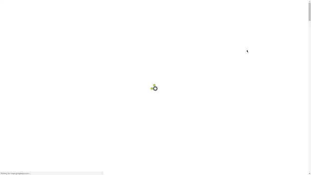

<<<<<<< HEAD
<a href="https://jekyll-themes.com">

</a>

# Orbit
> This theme is designed by Xiaoying Riley at [3rd Wave Media](http://themes.3rdwavemedia.com/). 
> Visit her [website](http://themes.3rdwavemedia.com/) for more themes.

I have made this into a Jekyll Theme. Checkout the live demo [here](https://webjeda.com/online-cv/).

<table>
  <tr>
    <th>Desktop</th>
    <th>Mobile</th>
  </tr>
  <tr>
    <td>
        
    </td>
    <td>
        
    </td>
  </tr>
</table>

## Installation

* [Fork](https://github.com/sharu725/online-cv/fork) the repository
* Delete the `gh-pages` branch
* Re-create the `gh-pages` branch
* Go to settings and set Github Pages source as master.
* Your new site should be ready at `https://username.github.io/online-cv/`

Change all the details from one place: ``_data/data.yml``

Watch my [video](https://www.youtube.com/embed/T2nx6tj-ZH4) on installation.

## Skins

There are 6 color schemes available:

| Blue | Turquoise | Green |
|---------|---------|---------|
|  |  |  |

| Berry | Orange | Ceramic |
|---------|---------|---------|
|  |  |  |

## Credits

Thanks to [Nelson Estevão](https://github.com/nelsonmestevao) for all the [contributions](https://github.com/sharu725/online-cv/commits?author=nelsonmestevao).

Thanks to [t-h-e(sfrost)](https://github.com/t-h-e) for all the [contributions](https://github.com/sharu725/online-cv/commits?author=t-h-e).

Check out for more themes: [**Jekyll Themes**](http://jekyll-themes.com).
=======
<p align="center">
  <a href="https://github.com/tbaltrushaitis/cv/releases"></a>
  <a href="https://github.com/tbaltrushaitis/cv/blob/master/LICENSE"></a>
  
  
</p>

<p align="center">
  <h1 align="center">CV, Resume and Portfolio website template</h1>
</p>

<p align="center">
  <a href="http://bit.ly/tomascv?ref=readme">
    
  </a>
</p>

<!-- # Best-in-Class modern CV, Resume and Portfolio # -->

:mortar_board: Best in Class modern CV, Resume and Portfolio website template.
All-in-One-Page site with simple and fully customizable builder.

`modern` `cv` `resume` `portfolio` `template` `portfolio-website` `cv-template` `IT` `cv-summary` `resume-template` `resume-website` `cv-website` `animated` `template-project`

---

## :computer: Live Demo ##
See it in action at :point_right: [Modern CV](http://bit.ly/tomascv?ref_domain=github.com&ref_section=docs&ref_file=readme) :point_left:

---

## What Is a Curriculum Vitae? ##

`Curriculum vitae` (CV) provides a summary of one’s experience and skills.

CVs include information on one’s academic background, including teaching experience, degrees, research, awards, publications, presentations, and other achievements. CVs are thus much longer than resumes, and include more information, particularly related to academic background.

A curriculum vitae summary is a one-to-two-page, condensed version of a full curriculum vitae. A CV summary is a way to quickly and concisely convey one’s skills and qualifications. Sometimes large organizations will ask for a `one-page CV` summary when they expect a large pool of applicants.

Full article about what is [Curriculum vitae](http://bit.ly/2QfaIBD)

---

## :runner: Usage ##

### 1. Clone the repository and enter its directory ###
```shell
$ APP_NAME=cv \
&& git clone https://github.com/tbaltrushaitis/${APP_NAME}.git \
&& cd ${APP_NAME}
```

### 2. Install the dependencies ###
```shell
$ make setup
```

### 3. Configure ###

Replace values in `config/person.json` with your personal information

### 4. Build ###
```shell
$ make build
```

### 5. Deploy ###
```shell
$ make deploy
```

This will create/update `webroot` directory inside the project root.
Use this directory as DocumentRoot in VirtualHost configuration of your web server.

### 6. Enjoy  ###

Post a link to your CV on sites where you need your personal profile page should be discovered by other users and that provide a lots of information about your professional skills and experience.
For example: [Modern CV](http://bit.ly/tomascv)

---

## :label: Components ##

 Name | Version | Scope | Description |
:-----|:-------:|:-----:|:------------|
 [animate.css](http://daneden.github.io/animate.css/) | 3.7.2 | Front | A cross-browser library of CSS animations
 [FontAwesome](https://fontawesome.com/) | 5.10.1 | Front | The iconic Font and CSS toolkit
 [Bootstrap](http://getbootstrap.com) | 3.3.7 | Front | Front-end framework for developing responsive, mobile first projects on the web
 [jQuery](http://jquery.com/) | 3.4.1 | Front | JavaScript Library
 [noty](http://ned.im/noty) | 2.4.1 | Front | Notification library
 [waypoints](https://github.com/imakewebthings/waypoints) | 4.0.1 | Front | Easily execute a function when you scroll to an element
 [wow.js](https://wowjs.uk/) | 1.3.0 | Front | Reveal CSS animation as you scroll down a page
 [iamx](https://trendytheme.net/items/i-am-x-html-resume-template/) | 1.2.0 | Front | Trendy Theme

## :wrench: Dev Tools ##

 Name | Description |
:-----|:------------|
 [bower](http://bower.io) | A package manager for the web
 [gulp](http://gulpjs.com) | Toolkit for automating tasks in development workflow
 [gulp-token-replace](https://github.com/Pictela/gulp-token-replace) | Token replace plugin for Gulp
 [jimp](https://github.com/oliver-moran/jimp) | An image processing library written entirely in JavaScript for Node
 [terser](https://github.com/terser-js/terser) | A JavaScript parser and mangler/compressor toolkit for ES6+

---

## :pushpin: Todo List ##

- [ ] - upgrade to noty v3
- [ ] - upgrade to bootstrap v4
- [ ] - implement require.js configuration
- [ ] - upgrade gulp to v4

See [CHANGELOG][Changelog] for the history of changes and improvements.

---

Read [LICENSE][License] for copyright information

---

### :link: More Info ###

 - [GitHub: Basic writing and formatting syntax](https://help.github.com/articles/basic-writing-and-formatting-syntax)
 - [BitBucket: markdown Howto](https://bitbucket.org/tutorials/markdowndemo)
 - [Linking containers](https://docs.docker.com/engine/userguide/networking/default_network/dockerlinks.md)
 - [Cross-host linking containers](https://docs.docker.com/engine/admin/ambassador_pattern_linking.md)
 - [Creating an Automated Build](https://docs.docker.com/docker-hub/builds/)

---
> Developed in **May 2016**
>>>>>>> parent of 82ce813... change name

:scorpius:

<<<<<<< HEAD
This project is licensed under the [MIT license](LICENSE.txt).
=======
[Changelog]: CHANGELOG.md
[License]: LICENSE.md
>>>>>>> parent of 82ce813... change name
